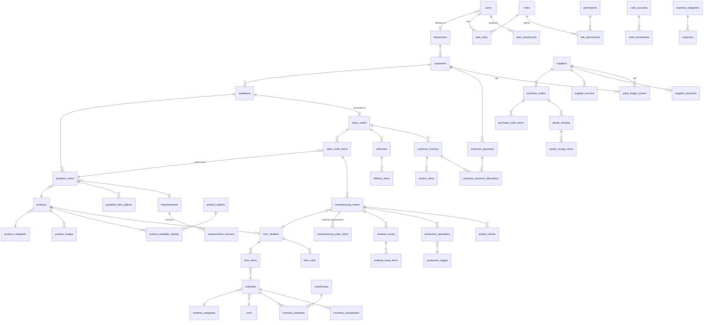

# Database

PostgreSQL 15+ (Supabase uses 15/17; local dev uses embedded PostgreSQL 17, UTF-8).
Schema: `packages/db/prisma/schema.prisma`. Migrations: `packages/db/prisma/migrations`.

## Conventions

- Tables/columns `snake_case`; Prisma models `PascalCase`, fields `camelCase` (`@map`).
- PK: `uuid` v7. Human identifiers: `code` (master data) / `number` (documents), unique.
- `created_at/by`, `updated_at/by`, `deleted_at/by` where applicable. `*_by` columns are soft
  references to `users.id` (no FK) — business user references (salesperson, inspector,
  assignee, manager, measured_by) are real FKs. The authoritative trail is `audit_logs`.
- Soft delete (`deleted_at`) for master data only. **Documents are never deleted after posting.**
- Money `numeric(18,2)`, quantities `numeric(18,4)`, unit costs `numeric(18,4)`, dimensions
  `numeric(10,1)` in **millimetres**, rates `numeric(5,2)` percent.
- All timestamps `timestamptz(3)`.

## Integrity (migration `*_integrity`)

| Rule | Mechanism |
|---|---|
| Stock never negative | `CHECK (inventory_balances.quantity >= 0)` + service-level lock/validation |
| Positive quantities/amounts | `CHECK` on all item and payment tables |
| Ledger entries one-sided | `CHECK ((debit = 0) <> (credit = 0))`, party consistency check |
| Paid ≤ total on invoices | `CHECK (paid_amount <= total)` |
| One active BOM per product | partial unique index |
| Ledgers/audit append-only | triggers block `UPDATE/DELETE` on `audit_logs`, `inventory_transactions`, `party_ledger_entries`, `cash_transactions` |
| Posted documents not deletable | triggers on invoices, receipts, issues, transfers, adjustments, quotations (non-draft), payments, expenses |
| Approved measurements frozen | trigger on `measurement_versions` |
| Supabase API lockout | RLS enabled on all tables, no policies; `anon`/`authenticated` privileges revoked |

Migration `*_search_indexes` adds `pg_trgm` GIN indexes for "contains" searches (customers, suppliers,
products, materials, document numbers). Prisma does not model them — if `prisma migrate dev` ever
proposes dropping them, remove those statements from the generated migration.

**Every new migration that adds a table must enable RLS on it.** A test
(`platform.test.ts › every public table has row level security enabled`) fails otherwise.

## Concurrency

- **Numbering:** `document_sequences(key, period)` row updated with
  `INSERT … ON CONFLICT DO UPDATE … RETURNING` inside the document's transaction.
- **Stock:** posting services lock `inventory_balances` rows with `SELECT … FOR UPDATE` in a
  deterministic order (material_id, warehouse_id) to avoid deadlocks, validate availability,
  then write ledger + balance. The CHECK constraint is the last line of defence.
- **Documents:** status changes use `UPDATE … WHERE id = ? AND status = ?` (optimistic) so two
  users cannot approve/post the same document twice.

## Connections (Supabase)

| Variable | Use | Supabase endpoint |
|---|---|---|
| `DATABASE_URL` | app runtime | Supavisor **transaction** pooler, port 6543 |
| `DIRECT_DATABASE_URL` | migrations, seed | direct connection or **session** pooler, port 5432 |

Transaction-mode pooling does not keep session state between transactions; the app never
relies on session-level features (advisory session locks, `SET` outside a transaction, LISTEN).

## Entity-relationship overview



## Table groups

- **Access:** users, user_sessions, login_history, roles, permissions, role_permissions, user_roles, user_warehouses
- **Master data:** showrooms, customers (+addresses, contacts), suppliers (+contacts), product_categories, products, product_images, product_options, product_available_options, material_categories, units, materials, warehouses, warehouse_locations, production_stages, expense_categories, cash_accounts
- **Sales:** quotations, quotation_items, quotation_item_options, sales_orders, sales_order_items, measurements, measurement_versions
- **Manufacturing:** bom_headers, bom_items, bom_rules, manufacturing_orders, manufacturing_order_items, material_issues, material_issue_items, production_operations, quality_checks
- **Inventory:** inventory_transactions, inventory_balances, stock_transfers(+items), stock_adjustments(+items)
- **Purchasing:** purchase_requests(+items), purchase_orders(+items), goods_receipts(+items), supplier_invoices(+items), supplier_payments
- **Delivery & finance:** deliveries(+items), customer_invoices, invoice_items, customer_payments, customer_payment_allocations, party_ledger_entries, cash_transactions, expenses
- **Platform:** document_sequences, attachments, notifications, audit_logs, translations, system_settings, jobs

## Commands

```bash
npm run db:local       # start local PostgreSQL 17 (port 54329)
npm run db:migrate     # create/apply migrations in development
npm run db:deploy      # apply migrations in production (uses DIRECT_DATABASE_URL)
npm run db:seed        # reference data + initial admin (+ demo master data if SEED_DEMO_DATA=true)
npm run db:validate    # schema validation + migration status
```
