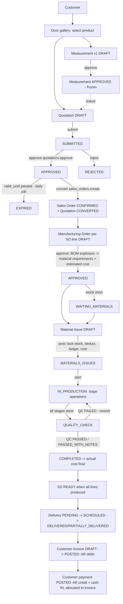
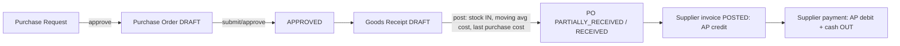

# Workflows

All status changes are validated server-side against the transition maps in
`packages/core/src/platform/state-machine.ts`. Arbitrary status updates are impossible through the API.

## 1. Sales → manufacturing → delivery → cash

### Quotation
`DRAFT → SUBMITTED → APPROVED | REJECTED`; `SUBMITTED → DRAFT` (sent back for edit);
`APPROVED → CONVERTED | EXPIRED | CANCELLED`; `DRAFT/SUBMITTED → CANCELLED`.
Only `DRAFT` is editable. Editing an approved quotation = **new revision** (`revision+1`,
`parent_id` = previous) — the approved one stays unchanged.

### Sales order
Created only from an `APPROVED` quotation (1:1, `quotation_id` unique). Commercial terms are
read from the quotation; SO lines track manufactured / delivered / invoiced quantities.
`CONFIRMED → IN_PRODUCTION → READY → PARTIALLY_DELIVERED → DELIVERED → CLOSED`;
`CONFIRMED → CANCELLED` only while no MO has issued materials.

### Manufacturing order
`DRAFT → APPROVED → (WAITING_MATERIALS →) MATERIALS_ISSUED → IN_PRODUCTION → QUALITY_CHECK → COMPLETED`;
`QUALITY_CHECK → IN_PRODUCTION` on failed QC (rework); cancel allowed before production starts
(issued materials must first be returned).

### Measurement
Version 1 is created as draft. Approval freezes the version (DB trigger). Any change after
approval creates version N+1 with a mandatory `change_reason`; MOs reference the exact version used.

## 2. Purchasing

Receipts cannot exceed ordered quantity per line. A posted receipt can be **reversed** (creates
negative ledger rows, only if stock is still available); it is never edited or deleted.

## 3. Inventory documents

| Document | Effect on ledger |
|---|---|
| Opening balance (adjustment, `is_opening`) | `OPENING_BALANCE` + |
| Goods receipt | `PURCHASE_RECEIPT` + |
| Material issue | `MATERIAL_ISSUE` − |
| Material return (issue type RETURN) | `PRODUCTION_RETURN` + |
| Transfer | `TRANSFER_OUT` − (from) and `TRANSFER_IN` + (to), same transaction |
| Adjustment | `ADJUSTMENT_IN` + / `ADJUSTMENT_OUT` − (reason required) |
| Reversal of any of the above | `REVERSAL` with opposite sign, `reversal_of_id` set |

## 4. Payments and reversals

- Payment posting writes: `customer_payments` row, `party_ledger_entries` credit, `cash_transactions` IN,
  and allocations to invoices (updating `paid_amount` and invoice status).
- Unallocated payment amount (e.g. deposit on a sales order) remains as customer credit and can be
  allocated later to that order's invoice.
- Reversal writes mirror entries (`REVERSAL`) and marks the payment `REVERSED`. Nothing is deleted.

## 5. Scheduled jobs

| Job | Schedule | Action |
|---|---|---|
| `quotations.expire` | daily | `APPROVED` quotations past `valid_until` → `EXPIRED` |
| `inventory.low_stock` | hourly | notifications for materials at/below reorder level |
| `payments.overdue` | daily | notifications for posted invoices past due date |
| `manufacturing.delayed` | hourly | notifications for MOs past required date and not completed |
| `sessions.cleanup` | daily | delete expired sessions older than 30 days |
